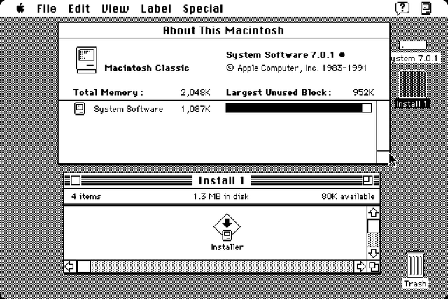

# Macintosh Classic core for MiSTer

An FPGA implementation of the **Apple Macintosh Classic** (1990) for the
[MiSTer](https://github.com/MiSTer-devel/Main_MiSTer/wiki) platform: the
last 68000 compact Mac, with a 512 × 342 black-and-white screen, ADB keyboard
and mouse, SCSI, and an internal **1.44 MB SuperDrive**.

The core runs the **Classic's own 512 KB ROM**, so it boots like the real
machine: the start-up chime, the 15-second wait for a hard disk, the happy Mac,
and the **System 6.0.3 ROM disk** that only the Classic has, reached with
⌘⌥XO. It runs System 6 and System 7 from hard disk images and floppies, reads
and writes 800K and 1.44 MB disks, and keeps its PRAM and clock between
sessions.



---

## The machine model

**Macintosh Classic (M0420), 1990.** Based on MiSTer **MacPlus**
core and adapted into a Classic including: its ROM, its memory map, ADB in place of the Plus keyboard, the SWIM floppy controller, and the Classic's PRAM.

| | |
|---|---|
| **CPU** | Motorola 68000 at 7.8336 MHz (cycle-exact [fx68k](https://github.com/ijor/fx68k)) |
| **ROM** | The Classic's 512 KB ROM (`$0276`, checksum `A49F9914`), with the System 6.0.3 ROM disk |
| **Memory** | 1 MB (stock), 2 MB or 4 MB |
| **Display** | 512 × 342, 1 bit; optional 640 × 480 (see below) |
| **Floppy** | One internal SuperDrive on a SWIM: 400K/800K GCR and 720K/1.44 MB MFM, read and write |
| **Hard disk** | SCSI (NCR 5380): internal disk at ID 0, external at ID 5 |
| **Keyboard / mouse** | ADB, from the MiSTer's USB keyboard and mouse |
| **Sound** | The Classic's 8-bit PWM sound |
| **Clock / PRAM** | The RTC with 256 bytes of extended PRAM, saved to a file |
| **Software** | Tested: System 6.0.3 (ROM disk), System 6.0.8 and System 7.0.1 (not included) |

### Classic QOL changes

- **640 × 480 mode.** A Classic's screen is fixed at 512 × 342. The optional
  **640x480** resolution patches the ROM as it is read (the ROM file is not
  changed), puts the screen in its own memory, and runs the CPU at about twice the speed so the larger screen redraws as quickly. Programs that draw directly to the screen assuming 512 × 342, or that time themselves by the CPU, may misbehave; use **Original** for them.
- **The mouse is scaled.** A modern mouse sends many more counts per inch than
  the Classic's, so its movement is halved before it reaches the Mac.
- **Serial.** One serial port goes to the MiSTer's UART, as in the MacPlus
  core; it has not been tested with this core.

---

## Core features

### Processor and system

- **The real ROM.** The Classic's ROM runs unmodified in Original mode,
  including its start-up tests, the 15-second wait for an internal hard disk,
  and the **ROM disk**: hold **⌘⌥XO** at start-up to boot System 6.0.3 with no
  disk at all.
- **1, 2 or 4 MB** of RAM, as the Classic's memory expansion card gives.

### Video

- **Original** is the Classic's 512 × 342 screen, with square pixels.
- **640x480** gives a larger 1-bit desktop (see above). While the Mac starts
  up in this mode the screen shows the Mac's grey until the ROM has drawn the
  desktop.

### Floppy

- One internal **SuperDrive**: **400K and 800K GCR, 720K and 1.44 MB MFM**,
  read **and write**. Copying to and from 800K and 1.44 MB disks works;
  formatting a blank disk has not been tested yet.
- Write-protected by default (**Floppy Write Protect**), so a disk is not
  changed until you choose.

### Hard disks

- **Internal** (SCSI ID 0) and **external** (SCSI ID 5) `.vhd` images up to
  2 GB, read/write. Main remembers both.

### PRAM and clock

- **Mount PRAM** keeps the Control Panel, Mouse, Sound, Startup Disk and Chooser
  settings in a 512-byte `.nvr` file. Changes are saved back automatically.
- The clock is set from the MiSTer's time, daylight saving included.

---

## OSD options

| Option | What it does |
|---|---|
| **Mount Floppy** | The internal SuperDrive: `.dsk`, raw images (see *Disk images*) |
| **Floppy Write Protect** | On (default) / Off - Off lets the Mac write to the floppy |
| **Mount Internal HDD** | The internal hard disk, SCSI ID 0, `.vhd`; remembered at the next start |
| **Mount External SCSI** | An external hard disk, SCSI ID 5, `.vhd`; remembered at the next start |
| **Mount PRAM** | The `.nvr` PRAM file; remembered and loaded at every start |
| **Resolution** | Original (512 × 342) / 640x480 - takes effect on **Reset** |
| **Aspect ratio** | Original / Full Screen / two custom ratios |
| **Scale** | Normal / V-Integer / Narrower HV-Integer / Wider HV-Integer |
| **Memory** | 1MB / 2MB / 4MB - takes effect on **Reset** |
| **Reset** | Restarts the Mac; also the MiSTer's reset button |

### About PRAM

**Mount PRAM** takes a 512-byte `.nvr` file; an empty one is in `releases/`.
Main remembers it and loads it at every start. Changes the Mac makes - in the
Control Panel, Mouse, Sound, Chooser or Startup Disk - are saved back to the
file about 2 s after the last change, and whenever the OSD is opened.

At start-up the Mac waits until the ROM and the PRAM file are loaded, so the
settings are always the file's. Without a PRAM file, PRAM starts blank at each
power-on, as on a Classic whose battery has been removed.

Mounting a PRAM file while the Mac is running does not restart it: the file's
settings take effect at the next **Reset**, and nothing is saved to the file
until then.

### About the 15-second wait

With no hard disk mounted, the Mac first waits about 15 s at the grey screen for
an internal disk, as a real Classic does, before it boots a floppy or the ROM
disk. A disk chosen in the **Startup Disk** control panel is kept in PRAM and
tried first.

---

## Installing on MiSTer

The core name is **`MacClassic`**, which is what MiSTer uses to find everything.

```
/media/fat/_Computer/MacClassic_YYYYMMDD.rbf
/media/fat/games/MacClassic/
        boot0.rom
        *.dsk  *.vhd  *.nvr
```

**`boot0.rom` is your Macintosh Classic ROM** (512 KB, checksum `A49F9914`).
It is not supplied. The core loads it into SDRAM at start-up; nothing of it is
in the bitstream.

---

## Disk images

| Kind | Extension | Notes |
|---|---|---|
| **Floppy** | `.dsk` | Raw sector images (DiskDup). **Read/write** unless Floppy Write Protect is on or the file is read-only |
| **Hard disk** | `.vhd` | Raw SCSI disk images with a partition map and driver, up to 2 GB (HFS). **Read/write** |
| **PRAM** | `.nvr` | 512 bytes |

### Floppy images

The SuperDrive reads raw images of exactly these sizes:

| Disk | Format | Image size |
|---|---|---|
| 400K | GCR | 409,600 bytes |
| 800K | GCR | 819,200 bytes |
| 720K | MFM | 737,280 bytes |
| 1.44 MB | MFM | 1,474,560 bytes |

**DiskCopy 4.2 images** (an 84-byte header and tag data) must be converted to
raw first. **Eject a disk from within the Mac** before mounting another: an
image may be in the middle of being written.

### Hard disk images

A raw `.img` disk image is the same format as `.vhd`: rename it.
[Disk Jockey](https://diskjockey.onegeekarmy.eu/) makes suitable images, with
the partition map and SCSI driver the Mac needs.

---

## Known limitations

- **640x480 is not a Classic.** Software that writes straight to the screen
  assuming 512 × 342, or times itself by the CPU's speed, misbehaves; Dark
  Castle's digitised sound, for example, crackles at 640 × 480 and is clean in
  Original.
- **No external floppy drive.** The serial port is untested.
- **System 6 without a printer driver.** A real Classic quirk, not a core bug:
  with no printer driver installed, some programs crash when they set up a page;
  MacDraw 1.9's Drawing Size, for example, divides by zero. Put a printer driver
  (such as ImageWriter) in the System Folder and select it in the Chooser.
  System 7 does not need this.

---

## Keyboard reference

The keys follow the way macOS maps a PC keyboard. Left and right modifiers both
work, and the numeric keypad is the Mac's.

| PC key | Mac key |
|---|---|
| `Windows` | Command (⌘) |
| `Alt` | Option (⌥) |
| `Ctrl` | Control |
| `Caps Lock` | Caps Lock |

**F12** stays the MiSTer's OSD key.

**ROM disk (System 6.0.3):** hold **Windows + Alt + X + O** (⌘⌥XO) from just
after the start-up chime, with Caps Lock off, until the happy Mac appears.

**Mouse:** set the pointer speed in the **Mouse** control panel as usual.

---

## Credits and attributions

### Core development

- **Diego Viso** ([@diegov-au](https://github.com/diegov-au)) - core development, hardware testing and verification.

### Built on

- **Plus Too** by **Steve Chamberlin** - the original FPGA Macintosh Plus
- The **MiSTer MacPlus core** by **Alexey Melnikov (Sorgelig)**, from
  **Till Harbaum**'s MiST port with updates from **danielb** - the starting point of this core: the memory
  and video controllers, the VIA, the SCSI and the SDRAM controller.
- **[fx68k](https://github.com/ijor/fx68k)** by **Jorge Cwik** - the
  cycle-exact 68000.
- **VIA 6522** by **Gideon Zweijtzer**.
- **NCR 5380 SCSI**, based on **minimigmac** by **Benjamin Herrenschmidt**.
- The **SuperDrive and SWIM** based on **Mac LC** MiSTer core by **danifunker**.

### Special thanks

- **[Snow](https://github.com/twvd/snow)** by **twvd** - a hardware-level
  emulator of the compact Macs, the Classic included. It was this core's
  behavioural reference for the Classic's memory map, VIA, ADB and SWIM.
- **[Mini vMac](https://www.gryphel.com/c/minivmac/)** by **Paul C. Pratt** -
  its large-screen hack located the Classic ROM's screen constants for the
  640 × 480 mode.
- **[Musashi](https://github.com/kstenerud/Musashi)** by **Karl Stenerud** -
  its disassembler drives the simulation harness's traces.

### Framework

- **[MiSTer](https://github.com/MiSTer-devel/Main_MiSTer)** framework (`sys/`) by
  **Alexey Melnikov (Sorgelig)**, **Till Harbaum** and the MiSTer-devel community -
  HPS interface, video scaling, audio output and the OSD.

---

## Licence

**GPL-3.0**, as the components it is built from (fx68k and the SDRAM controller
are GPL-3.0; the MiSTer framework is GPL-2.0 or later). Apple's ROM and system
software are not part of this core.

---

This core was developed with the assistance of AI. The RTL changes, the
simulation harness and the documentation were written collaboratively with AI,
with every behaviour checked against the Classic's ROM, the Snow emulator,
Apple's documentation and a real DE10-Nano.
